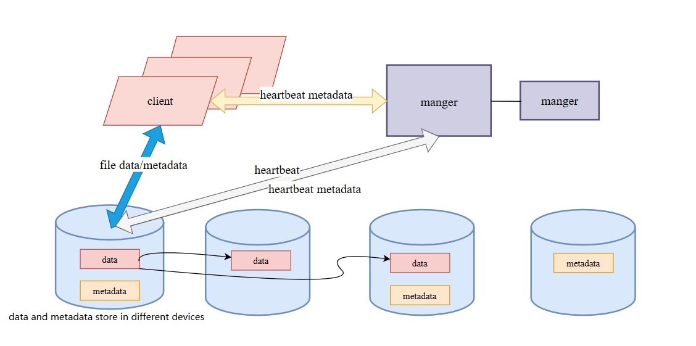

# SEALFS

[sealos](https://github.com/labring/sealos)的存储底座，我们希望构建一个适用于云原生的高性能，高可靠，弹性伸缩的分布式文件存储

## 系统架构
sealfs的架构为无中心架构，且无独立的元数据节点，我们希望尽最大可能提升读写性能和解决存储海量小文件问题

- server负责文件以及元数据存储。
- client实现用户态的文件系统，对文件请求进行拦截并通过哈希算法进行存储寻址。
- manager负责协调集群。
  设计图如下：
- 

### 全链路用户态
我们希望结合特定硬件从客户端文件请求劫持到网络到存储打造一个全链路用户态的分布式文件存储系统，从而获得极致的性能体验。

更多设计可以参考：
### 设计文档
[设计文档](https://github.com/labring/sealfs/blob/main/docs/README-ZH.MD)

## 实现计划
目前我们致力于全链路性能提升，对于其他方面的建设如高可靠性以及高可用性的优先级会低一些
- 第一版功能实现：
  - 客户端:
    - [ ] fuse文件系统接口
    - [ ] 系统调用劫持（用户态文件系统）
    - [ ] 选址算法
    - [ ] 批处理

  - 服务端:
    - [ ] 绕过本地文件系统
    - [ ] 磁盘管理
    - [ ] 目录管理
    - [ ] 元数据持久化内存存储
    - [ ] 文件索引
    - [ ] 文件锁
    - [ ] 持久化数据结构
    
  - 协调节点:
    - [ ] 心跳管理
    
  - 网络:
    - [ ] RDMA
    - [ ] socket网络通信

  - 测试
    - [ ] IO500
    - [ ] 功能测试

## 编译

```bash
cargo build
```

## 快速使用

### 挂载

```bash
mkdir ~/fs
./target/debug/server &
./target/debug/client ~/fs
```

### 文件操作

show directory
```bash
ll ~/fs
```
create file
TODO

read file
TODO

write file
TODO

delete file
TODO

## 开源协议
[Apache License 2.0](https://github.com/labring/sealfs/blob/main/LICENSE)